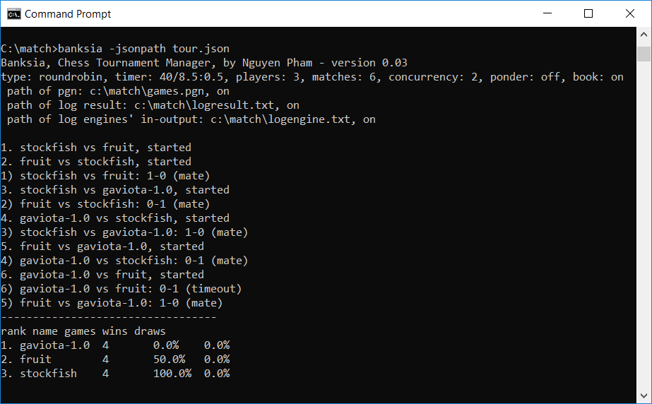

# Banksia - a Chess tournament manager

Overview
-----------

Banksia (a name of an Australian native wildflowers) is an open source chess tournament manager for chess engines. The code is written in C++ (using standad C++11 library). It can be compiled and run in popurlar flatforms such as Windows (tested, for both 32 and 64 bit app), MacOS (tested), Linux (not tested).

To manage engines, games and the complicated events / relationships between them, the app uses a timer with few c++ callback functions. I believe it is one of the simplest way thus the code is not hard for programmers to follow, understand, maintain and modify.

Some features
-----------
- Command line interface (cli)
- Small, fast
- Simple and short (in term of design and implementation)
- Support UCI and Winboard protocols
- Support opening book formats edp, pgn, bin (Polyglot)
- Tournament: concurrency, round robin, knockout, ponderable, resumable
- Controlled mainly by 2 JSON files (one for configurations of engines, one for tournament management). That is very flexible, easy way to setup and change
- Can auto generate all neccessary JSON files
- Controllable by keyboard when games playing (type anything from keyboard to display the help)
- Written in standard C++11
- Open source, MIT license

Compile
----------
There are some project files for building by Visual Studio or Xcode.

If you want to compile those code manually, use g++ to compile and link as bellow:

    g++ -std=c++11 -c ../src/3rdparty/process/process.cpp ../src/3rdparty/process/process_unix.cpp -O2 -DNDEBUG
    g++ -std=c++11 -c ../src/3rdparty/json/*.cpp -O2 -DNDEBUG
    g++ -std=c++11 -c ../src/base/*.cpp -O2 -DNDEBUG
    g++ -std=c++11 -c ../src/chess/*.cpp -O2 -DNDEBUG
    g++ -std=c++11 -c ../src/game/*.cpp -O2 -DNDEBUG
    g++ -std=c++11 -c ../src/*.cpp -O2 -DNDEBUG
    g++ -o banksia *.o

In MS Windows, the first line needed to change to:

    g++ -std=c++11 -c ../src/3rdparty/process/process.cpp ../src/3rdparty/process/process_win.cpp -O2 -DNDEBUG

You can also use CMake (at least version 3.7 is required) to build banksia:

    mkdir build
    cd build
    cmake ..
    make -j4

Using
-------
Banksia requires two JSON files to work. Almost all fields in those files are self-explaination via meanings of their names.

1) a JSON file to store engine's configurations

Configuration of each engine may includ options thus users can control all details.

2) a JSON file to store information about tournament such as match type, path of engine configuration JSON file (JSON file 1), log path...

Some important fields:
- type: type of tournament. At the moment it accepts only value 'roundrobin'
- time control: second is the unit for all value fields. You can use fractions (such as 1.5 as 1.5 second) for being more precision.
- players: names of players will participate the tournament. They must be listed in JSON file 1.

      "players" : [ "stockfish", "gaviota", "fruit" ]

Run the app in a console as bellow:
    
     banksia -jsonpath c:\tour\tour.json

There are two JSON files come with the project as an example.

When working, the app may display some information into screen as well as saving into some log files (controlled by tournament's JSON file 2):
- results
- engine input / output log
- game pgn file

Bellow is the screen of a tournament between 3 chess engines:

Resume
-------
Banksia can resume a tournament from where it stopped. That function can be enabled/disnabled via tag "resumable" in control JSON file (default is on). When playing Banksia will store all neccessary information into file playing.json, save it in current working folder then uses it to resume the tournament. If you don't want to resume the previous tournament, type "no" when Banksia asks, or add parametter -no to command line, or delete that file.

You may also create a total new tournament as your design (you can change openings, time control...) or even generate it automatically.

Auto generate JSON files
--------------------------
A chess tournament may have tens or even hundreds of chess engines. Each engine has name, command line, working folder and may have tens parameters. Any wrong in data may cause engines to refuse to run, crash or run with wrong performances. However, writing down manually all information into a command line and/or some JSON files is so boring, hard job and easy to make mistake (from my experience, it is not easy to find and fix those mistakes). Banksia itself has tens of parameters to control everything of matches such as type, time control, concurrency, opening...  and even those parameters can explain meaning themself, users need to consume its documents to know about them.

Depend on experience, it may take from hours to days to create a runnable configuration for a new tournament. Furthermore, new engines may frequently add or change parameters without notice to users and make situation worse.

Banksia can help to solve the above problems by generating/updating automatically all data needed for a tournament. If the old data exists, Banksia can update it without erasing nor modifying non-involving information. Thus users can update frequently their data.

What a user should do to generate or update JSON files:
- copy all engines into a folder (including their belonging files as well as all subfolders)
- run Banksia with that folder as a parameter and wait for few minutes. That all!

For example:

    banksia -u -c 4 -d c:\allenginefolder

Bankisa scans that given folder, including subfolder for all executable files, then runs them to detect if they are chess engines, what their chess protocols and options are. Bankisa can run and test concurrently (the parameter -c 4 means that is concurrency of 4) to speed up the process (for a tournament within 20 engines, 4 concurrencies all may take about 1 - 5 minutes). All information is saved or updated into two key JSON files (if their paths are not specified, they will be created in the current working folder).

If users don't want Banksia to scan (or engines are not scannable, or located in different folders/drivers) or run not-involving executable files, they can create a simple and short JSON file (file engines.json) with commands of engines they need (and don't use parametter -d). Banksia will verify and fill in all other information.

    [
        { "command" : "d:/stockfish/stockfish.exe" },
        { "command" : "c:/match/crafty25.3" }
    ]

Right after generating JSON files, users can start their tournaments:

    banksia -jsonpath c:\tour.json

Of course, users can edit those JSON files such as removing redundant, unused fields, re-order them to be easier to read! Some data fields are written down in empty forms (such as opening book folders) and need to fill in.

Working
---------
- Improve interface
- Support some different tournament types: swiss
- Support other chess variants (not soon event it is designed for multi-variants)

History
--------
- 14 July 2019: v2.2, knockout tournament and resumable the last tournament
- 12 July 2019: v2.0, auto generating JSON files
- 10 July 2019: v1.50, Polyglot's opening books
- 8 July 2019: v1.00, Winboard protocol
- 3 July 2019: v0.03, pgn opening
- 1 July 2019: version 0.01, first release

Terms of use
---------------

The project is released under the liberal [MIT license](http://en.wikipedia.org/wiki/MIT_License), so basically you can use it with almost no restrictions.

Credits
--------

Banksia was written by Nguyen Hong Pham (axchess at yahoo dot com).

