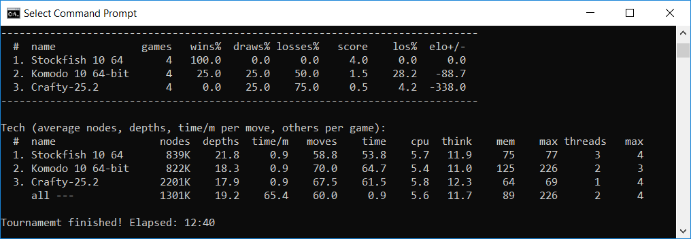

# Banksia - a Chess tournament manager

Overview
-----------

Banksia (the name after an Australian native wildflowers) is an open source tournament manager for chess engines, written in C++11. It can be compiled and run on some popular platforms such as Windows, macOS, Linux.

The project is an attempt to fulfil my dream about creating a chess tournament manager: small, fast, portable, easy to use, easy to integrate to other systems, resumable, able to automatically generate all configurations, files which are needed for tournaments.

Basically from nothing, a user can configure automatically within few minutes then he can start running a total new tournament.

About design: To manage engines, games and the complicated events / relationships between them, the app uses a timer with few c++ callback functions. I believe it is one of the simplest methods. The code is not hard for programmers to follow, understand, maintain and modify.

*(Banksia)*

Some features
-----------
- Command line interface (cli)
- Small, fast
- Simple and short (in terms of design and implementation)
- Support UCI and Winboard protocols
- Support opening book formats: edp, pgn, bin (Polyglot)
- Support adjudication including Syzygy 7 pieces
- Tournament: round robin, knockout, swiss, concurrency, ponderable, resumable
- Profile engines for some important info such as cpu, memory consumed, numbers of threads.
- Controlled mainly by 2 JSON files (one for configurations of engines, one for tournament management). That is very flexible, easy way to setup and change
- Can auto generate all necessary JSON files
- Central control: modify threads (cores), hash (memory), syzygy path... in one place and affect all engines
- Controllable by keyboard when games playing (type anything from keyboard to display the help)
- Written in standard C++11
- Open source

Compile
----------
There are some project files for building by Visual Studio or Xcode.

If you want to compile those code manually, use g++ to compile and link as below:

    g++ -std=c++11 -c ../src/3rdparty/process/process.cpp ../src/3rdparty/process/process_unix.cpp -O2 -DNDEBUG
    g++ -std=c++11 -c ../src/3rdparty/json/*.cpp -O2 -DNDEBUG
    g++ -std=c++11 -c ../src/3rdparty/fathom/*.cpp -O2 -DNDEBUG
    g++ -std=c++11 -c ../src/base/*.cpp -O2 -DNDEBUG
    g++ -std=c++11 -c ../src/chess/*.cpp -O2 -DNDEBUG
    g++ -std=c++11 -c ../src/game/*.cpp -O2 -DNDEBUG
    g++ -std=c++11 -c ../src/*.cpp -O2 -DNDEBUG
    g++ -o banksia *.o

In MS Windows, the first line needed to change to:

    g++ -std=c++11 -c ../src/3rdparty/process/process.cpp ../src/3rdparty/process/process_win.cpp -O2 -DNDEBUG

You can also use CMake (at least version 3.7 is required) to build banksia:

    mkdir build
    cd build
    cmake ..
    make -j4

Using
-------
Banksia requires two JSON files to work. Almost all fields in those files are self-explanation via meanings of their names. If you generate them automatically (read next sections) they may have some fields "tips" as short guides how to use, which values to fill.

1) a JSON file to store engine's configurations

Configuration of each engine may include options thus users can control all details.

2) a JSON file to store information about the tournament such as tournament type, path of engine configuration JSON file (JSON file 1), log paths...

Some important fields:
- type: type of tournament
- time control: second is the unit for all value fields. You can use fractions (such as 1.5 as 1.5 second) for being more precision.
- players: names of players will participate in the tournament. They must be listed in JSON file 1.

      "players" : [ "stockfish", "gaviota", "fruit" ]

Run the app in a console as bellow:

     banksia -jsonpath c:\tour\tour.json

There are two JSON files come with the project as an example.

When working, the app may display some information into screen as well as saving into some log files (controlled by tournament's JSON file 2):
- results
- engine input / output log
- game pgn file

Bellow is the screen of a tournament between 3 chess engines:

If Banksia runs with profile mode (for Windows only), it could provide some useful information about engines such as memory and cpu usages, number of threads.

Resume
-------
Banksia can resume a tournament from where it stopped. That function can be enabled/disabled via field "resumable" in control JSON file (default is on). When playing Banksia will store all necessary information into file playing.json, save it in current working folder then uses it to resume the tournament.

If you don't want to resume the previous uncompleted-tournament, type "no" when Banksia asks, or add parameter -no to the command line, or delete that file.

You may also create a total new tournament as your desire (you may change openings, time control...) or even generate it completely for fully controlling.

Auto generate JSON files
--------------------------
A chess tournament may have tens or even hundreds of chess engines. Each engine has name, command line, working folder and may have tens parameters. Any wrong in data may cause engines to refuse to run, crash or run with wrong performances. However, writing down manually all information into a command line and/or some JSON files is so boring, hard job and easy to make mistakes (from my experience, it is not easy to find and fix those mistakes). Banksia itself has tens of parameters to control everything of matches such as type, time control, concurrency, opening...  and even those parameters can explain meaning themselves, users need to consume its documents to know about them.

Depend on experience, it may take from hours to days to create a runnable configuration for a new tournament. Furthermore, new engines may frequently add or change parameters without notice to users and make the situation worse.

Banksia can help to solve the above problems by generating/updating automatically all data needed for a tournament. If the old data exists, Banksia can update it without erasing nor modifying non-involving information. Thus users can update frequently their data.

What a user should do to generate or update JSON files:
- copy all engines into a folder (including their belonging files as well as all subfolders)
- run Banksia with that folder as a parameter and wait for a few minutes. That's all!

For example:

    banksia -u -c 4 -d c:\allenginefolder

Banksia scans that given folder, including subfolder for all executable files, then runs them to detect if they are chess engines, what their chess protocols and options are. Banksia can run and test concurrently (the parameter -c 4 means that is concurrency of 4) to speed up the process (for a tournament within 20 engines, 4 concurrencies all may take about 1 - 5 minutes). All information is saved or updated into two key JSON files (if their paths are not specified, they will be created in the current working folder).

If users don't want Banksia to scan (or engines are not scannable, or located in different folders/drivers) or run not-involving executable files, they can create a simple and short JSON file (file engines.json) with commands of engines they need (and don't use parameter -d). Banksia will verify and fill in all other information.

    [
        { "command" : "d:/stockfish/stockfish.exe" },
        { "command" : "c:/match/crafty25.3" }
    ]

Right after generating JSON files, users can start their tournaments:

    banksia -t c:\tour.json

Of course, users can edit those JSON files such as removing redundant, unused fields, re-order them to be easier to read! Some data fields are written down in empty forms (such as opening book folders) and need to fill in.

**Tips:**
- In Windows the number of files to check is the number of exe files and they are almost engines and the process is fast, you don't need to worry nor do anything
- In Unix-platforms, the number of files which are masked as runnable may be large and few times as the number of engines. Banksia has filtered out many files based on their extensions but the number may still large. To avoid the process takes too long, you may:
+ increase the number of concurrency, even few times as many as real cores on your computer. Many tasks of checking files are just idle and wait for timeout and they don't require computer power. For example, on my iMac of 4 cores, I usually set -c 16 and the process is completed within 3 minutes after checking about 70 files in which there are 23 engines.
+ mark some files as unexecutable
+ move them to other folders

You can help
-------
If you download and use Banksia you already help me. All bug reports, suggestions, contributions are more than welcome!

Below are some features/functions we need someone helps too:
- Elo and error margin: to show when a tournament completed
- Profile for Linux and macOS: for Linux, I don’t know how to get memory/cpu usages without calling some external programs which are too slow to sample chess engines; for macOS, the security requires some complicated code/steps and not easy to implement
- All parameters in command line (not using JSON files): I am not a fan of having long command lines. However if you think it may be useful and willing to help us to make it work, please go ahead

Working
---------
- Improve interface
- Support other chess variants (not soon event it is designed for multi-variants)

History
--------
- 30 July 2019: v3.0, Swiss tournament, opening ECO, engine profile, game adjudication (Syzygy 7 pieces), improve JSon updating
- 22 July 2019: v2.7, inclusive players (for playing in all matches, given sides), more info for tournament stats
- 20 July 2019: v2.6, more info and more ways to control logs, improve engine managements
- 16 July 2019: v2.5, multiple ways to select openings: new for each match, same for a pair, one for all matches; override options for central controlling; match statistics LOS & error margin
- 14 July 2019: v2.2, knockout tournament and resumable the last tournament
- 12 July 2019: v2.0, auto generating JSON files
- 10 July 2019: v1.5, Polyglot's opening books
- 8 July 2019: v1.0, Winboard protocol
- 3 July 2019: v0.03, PGN opening
- 1 July 2019: version 0.01, first release

GUI
----

I started working on a graphic user interface app based on Banksia.

Terms of use
---------------

All codes and data in the folder 3rdparty are 3rd party libraries, copyrighted by them and under their terms of use. Banksia code and data are released under the GPLv3+ license.

Credits
--------

Banksia was written by Nguyen Hong Pham (axchess at yahoo dot com).

